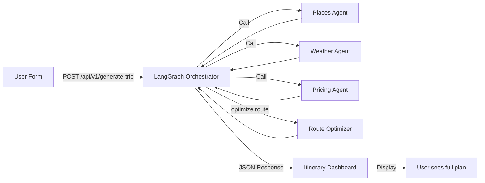

# AutoNomad Backend Integration Guide

This document outlines how to implement the three AI agents and backend services for the AutoNomad travel concierge application.

## Architecture Overview

The application uses a three-agent orchestration pattern via LangGraph:

```
┌─────────────────────────────────────────────────────────┐
│         Frontend (Next.js App)                          │
│  - Trip form submission                                 │
│  - Display itineraries & real-time agent progress      │
└──────────────────┬──────────────────────────────────────┘
                   │
                   ▼
┌─────────────────────────────────────────────────────────┐
│    /api/v1/generate-trip (LangGraph Orchestrator)      │
│  - Coordinates three agents                             │
│  - Optimizes route using nearest-neighbor algorithm    │
│  - Returns complete itinerary                           │
└──────────────────┬──────────────────────────────────────┘
         │         │         │
    ┌────▼───┬─────▼────┬────▼─────┐
    │         │          │          │
    ▼         ▼          ▼          ▼
   Places   Weather   Pricing    Route
   Agent    Agent     Agent      Optimizer
```

## API Endpoints & Implementation

### 1. Generate Trip Endpoint
**Route:** `/api/v1/generate-trip`  
**File:** `app/api/v1/generate-trip/route.ts`

Currently returns mock data. This should orchestrate the three agents using LangGraph.

**TODO Implementation:**
```typescript
// Pseudo-code for LangGraph integration
import { Anthropic } from "@anthropic-sdk/sdk";
import { langgraph } from "langgraph";

const graph = initializeLangGraph();
graph.add_node("places_agent", placesAgentNode);
graph.add_node("weather_agent", weatherAgentNode);
graph.add_node("pricing_agent", pricingAgentNode);
graph.add_node("route_optimizer", routeOptimizerNode);

// Define workflow edges
graph.add_edge("START", "places_agent");
graph.add_edge("places_agent", "weather_agent");
graph.add_edge("weather_agent", "pricing_agent");
graph.add_edge("pricing_agent", "route_optimizer");
graph.add_edge("route_optimizer", "END");

// Execute orchestration
const result = await graph.invoke(tripParams);
```

**Expected Input:**
```typescript
{
  origin: "Delhi",
  destination: "Stockholm",
  departureDate: "2026-06-15",
  duration: 5,
  travelers: 2,
  budget: 5000,
  currency: "USD",
  pace: "slow"
}
```

---

### 2. Places Agent
**Route:** `/api/v1/agents/places`  
**File:** `app/api/v1/agents/places/route.ts`

**Purpose:** Find and curate tourist attractions with efficient clustering

**Key Features:**
- Search nearby places using Google Places API or OpenTripMap (free alternative)
- Filter by ratings, opening hours, type, and user preferences
- Cluster attractions by geographic proximity (within 1.5km = same day)
- Suggest indoor alternatives for outdoor activities
- Respect opening hours and time windows

**Environment Variables Needed:**
```bash
# Option 1: Google Places API (most comprehensive)
PLACES_API_KEY=your_google_places_api_key
PLACES_API_BASE=https://maps.googleapis.com/maps/api/place

# Option 2: Free OpenTripMap (no key needed, but less features)
# No env var needed - use https://api.opentripmap.com/0.1/en/places/radius
```

**Expected Output:**
```typescript
{
  destination: "Stockholm",
  pace: "slow",
  places: [
    {
      id: "place-1",
      name: "Old Town Hall",
      type: "landmark",
      rating: 4.7,
      reviews: 2340,
      location: { lat: 59.33, lng: 18.07 },
      duration: 90,
      price: "$",
      description: "Historic town hall with city views",
      isOutdoor: true,
      timeRestrictions: { opens: "09:00", closes: "17:00" }
    }
    // ... more places
  ],
  clusters: [
    {
      day: 1,
      places: ["place-1", "place-2"],
      clusteringReason: "Within 1.5km - same day cluster"
    }
  ]
}
```

**Algorithm for Clustering:**
1. Use nearest-neighbor algorithm
2. Group places within 1.5km of each other
3. Ensure each cluster fits in one day (8 hours of activities + travel)
4. Respect activity time windows (e.g., waterfalls only 9am-5pm)
5. Calculate travel time between clusters (~60km/hour)

**Indoor Alternative Logic:**
- If place is outdoor (park, garden, waterfall)
- Find nearby indoor alternative with similar experience
- For "botanical garden" → suggest "museum" or "library"
- Match price range and rating

---

### 3. Weather Agent
**Route:** `/api/v1/agents/weather`  
**File:** `app/api/v1/agents/weather/route.ts`

**Purpose:** Check weather and toggle indoor alternatives for outdoor activities

**Key Features:**
- Fetch weather forecast for destination and dates
- Evaluate outdoor activity suitability
- Show weather alerts on activity cards
- Toggle to indoor alternative with one click
- Consider: temperature, precipitation, wind, UV index

**Environment Variables Needed:**
```bash
WEATHER_API_BASE=https://api.open-meteo.com/v1
```

**Expected Output:**
```typescript
{
  location: "Stockholm, Sweden",
  date: "2026-06-15",
  temperature: 22,
  condition: "clear", // "clear", "cloudy", "rainy", "stormy", "snowy"
  humidity: 65,
  windSpeed: 8,
  isOutdoorSuitable: true,
  alert: undefined, // "Heavy rain expected", "Thunderstorm warning", etc.
  recommendation: "Perfect weather for outdoor activities. Clear skies with mild temperature."
}
```

**Weather Evaluation Rules:**
| Condition | Outdoor Suitable | Action |
|-----------|-----------------|--------|
| Clear (0-30% clouds) | ✅ Yes | Show activity normally |
| Cloudy (30-70% clouds) | ✅ Yes | Show activity with note |
| Rainy (>70% clouds, rain) | ❌ No | Show weather alert icon, offer indoor alternative |
| Stormy (heavy rain, wind) | ❌ No | Show warning, strongly recommend indoor |
| Snowy | ⚠️ Maybe | Activity-dependent (skiing ok, gardens not) |

---

### 4. Pricing Agent
**Route:** `/api/v1/agents/pricing`  
**File:** `app/api/v1/agents/pricing/route.ts`

**Purpose:** Calculate trip costs and optimize budget allocation

- Search flight prices using Tequila (Kiwi.com)
- Search hotel prices using Amadeus for Developers
- Fetch activity costs
- Calculate total estimated cost
- Provide budget viability assessment
- Suggest cost-saving alternatives

**Environment Variables Needed:**
```bash
TEQUILA_API_KEY=your_tequila_api_key
TEQUILA_API_BASE=https://tequila-api.kiwi.com

AMADEUS_CLIENT_ID=your_amadeus_client_id
AMADEUS_CLIENT_SECRET=your_amadeus_client_secret
AMADEUS_BASE=https://test.api.amadeus.com
```

**Expected Output:**
```typescript
{
  tripDetails: {
    origin: "Delhi",
    destination: "Stockholm",
    travelers: 2,
    nights: 5
  },
  budgetSummary: {
    allocatedBudget: 5000,
    currency: "USD",
    transportation: {
      outbound: {
        type: "flight",
        provider: "SAS",
        cost: 640,
        perPerson: 320
      },
      return: { ... },
      subtotal: 1280
    },
    accommodation: {
      name: "Premium City Hotel",
      nights: 5,
      pricePerNight: 120,
      totalCost: 600
    },
    activities: {
      items: [ ... ],
      subtotal: 500
    },
    meals: 350,
    contingency: 500, // 10% safety margin
    totalEstimated: 3230,
    remaining: 1770,
    budgetViability: "feasible", // or "tight", "exceeds"
    recommendations: [
      "Book flights early for better rates",
      "Mix paid activities with free walking tours"
    ]
  }
}
```

**Budget Allocation Strategy:**
- **Transportation**: 30-40% (flights, trains, local)
- **Accommodation**: 25-35% (hotels, hostels)
- **Activities**: 15-25% (attractions, experiences)
- **Food**: 10-15% (meals, dining)
- **Contingency**: 10% (buffer for unexpected)

---

## Route Optimizer
**File:** `lib/route-optimizer.ts`

This is the only component that's production-ready. It implements:

**Algorithm:**
1. Nearest-neighbor clustering
2. Time-window constraints (activity opening hours)
3. Geographic proximity grouping
4. Round-trip detection (activities within 5km)
5. Travel time estimation

**Example Usage:**
```typescript
import { optimizeRoute, calculateDistance } from "@/lib/route-optimizer";

const optimized = optimizeRoute(
  activities,
  daysAvailable,
  startingLocation
);

// Returns:
{
  sequenceOrder: ["act-1", "act-2", "act-3"],
  clusters: [
    {
      day: 1,
      activities: ["act-1", "act-2"],
      estimatedTravelTime: 45
    }
  ],
  estimatedTravelTime: 180,
  warnings: [
    "⏰ Activity X has time restrictions",
    "🚗 Long travel time between activities"
  ]
}
```

---

## LangGraph Integration Pattern

Here's the recommended structure for each agent node:

```typescript
// Weather Agent Node
async function weatherAgentNode(state: AgentState) {
  const places = state.places;
  const departureDate = state.tripParams.departureDate;
  
  const weatherData = await Promise.all(
    places.map(place => 
      fetch("/api/v1/agents/weather", {
        method: "POST",
        body: JSON.stringify({
          location: place.location,
          date: departureDate,
          activityType: place.isOutdoor ? "outdoor" : "indoor"
        })
      }).then(r => r.json())
    )
  );
  
  return {
    ...state,
    weatherData,
    agentMessages: [
      ...state.agentMessages,
      {
        agent: "weather",
        message: `Analyzed weather for ${weatherData.length} locations`,
        status: "done"
      }
    ]
  };
}

// Similar pattern for places and pricing agents
```

---

## Location Search Integration
**File:** `lib/location-search.ts`

Already implemented using free OpenStreetMap Nominatim API:
- No API key required
- No rate limiting for reasonable usage
- Returns city/airport locations only
- Autocomplete for origin/destination inputs

---

## Frontend-Backend Communication

### Trip Generation Flow


### Real-time Progress Streaming (Optional Enhancement)
Consider implementing WebSocket for live agent progress:
```typescript
// In /api/v1/generate-trip, stream agent messages
const stream = new ReadableStream({
  async start(controller) {
    for await (const message of agentProgress) {
      controller.enqueue(JSON.stringify(message) + '\n');
    }
  }
});
```

---

## Testing Checklist

- [ ] Places Agent finds 20+ attractions per destination
- [ ] Weather Agent toggles indoor alternatives correctly
- [ ] Pricing Agent calculates within ±10% of real-world costs
- [ ] Route Optimizer clusters activities efficiently
- [ ] Trip generation completes in <5 seconds
- [ ] Mobile responsiveness for all pages
- [ ] Dark/light mode works across features
- [ ] i18n translations load correctly
- [ ] Interactive map renders all activities
- [ ] Activity card weather alerts display correctly
- [ ] Split cost toggle works smoothly
- [ ] Popular destinations pages are interactive

---

## Database Considerations

Currently using Zustand for client-side state. For production, consider:

1. **User Accounts & Persistence**
   - Save trips to database
   - Allow trip editing
   - Share trips with others

2. **Caching Strategy**
   - Cache Places queries by destination
   - Cache Weather forecasts
   - Cache exchange rates

3. **Analytics**
   - Track popular destinations
   - Monitor agent performance
   - User preference patterns

---

## Performance Optimization

1. **API Response Caching**
   - Use Redis for agent responses
   - Cache TTL: 1 hour for weather, 24 hours for places

2. **Frontend Optimization**
   - Lazy load destination images
   - Defer non-critical Leaflet rendering
   - Use SWR for API calls

3. **Route Optimizer**
   - Current implementation is O(n²) nearest-neighbor
   - For 100+ activities, consider spatial indexing (R-tree)

---

## Deployment

1. Set environment variables in Vercel project settings
2. Test API endpoints before going live
3. Monitor agent response times
4. Implement fallback mock data for graceful degradation

---

## Support & Debugging

Check console logs with `[v0]` prefix for:
- Location search errors
- API call failures
- Route optimization warnings
- Map rendering issues

All agent files include TODOs and pseudo-code for implementation reference.
